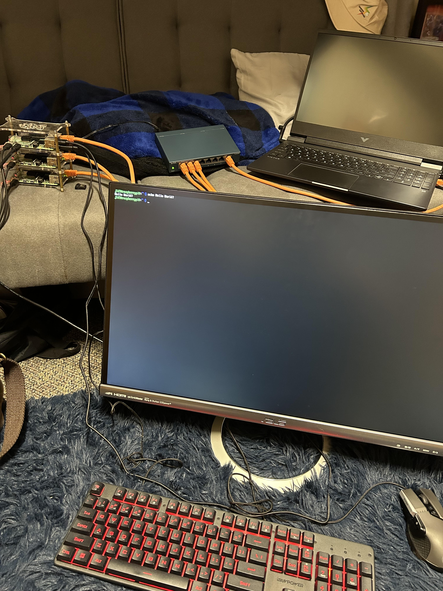

# HPC-Mini-Cluster

Welcome! The following is my procedure for setting up an HPC Mini-Cluster made up of Raspberry Pi devices for ECE 4990. The goal of this project is to learn about HPC and prepare for SC25!

## Getting Started

Before beginning, collect the necessary materials of the Pi Cluster Kit, including the Raspberry Pi devices, micro SD card, power cables, ethernet cables, network switch, and power supply.

Then, begin cabling everything up. Make sure to plug in the power supply and network switch to the wall power, and connect the pis to the power supply and network switches. I recommend following this [link](https://epcced.github.io/wee_archlet/#intro) for the hardware setup.

## SD Card Setup

To install the OS, install the following [tool](https://www.raspberrypi.com/software/). Insert your microSD card into your computer (using an adapter or the microSD card slot) and open the Raspberry Pi Imager. In the GUI, select the version of Raspberry Pi you are using (in my case it was Raspberry Pi 4), click Raspberry Pi OS (other) to select Raspberry Pi OS Lite (64 bit) for our OS, and finally select the SD card that you are using. After clicking Next, you'll want to select Edit Settings to create a hostname, username, password, and enable ssh under the services tab for your OS. I also recommend setting up your Wi-Fi connection in the OS during this step. Finally, apply the settings you just configured and install the OS onto the SD card.


To make sure that it worked properly, insert your microSD card into the Raspberry Pi and connect a monitor, mouse, and keyboard to the Raspberry Pi. If all went well, you should see a terminal appear on the monitor! Go ahead and repeat these steps for each Raspberry Pi in your setup.



## Networking

After setting up your Raspberry Pi devices and installing the operating systems, let's make it to where we can ssh into each device via Wi-Fi. To do this, if you're on-campus, you'll need to obtain the MAC addresses for each device and register them with resmedianet. To do this, you can run the commands `ifconfig` or `ip -c a` to display them while having the Raspberry Pi device connected to another monitor and keyboard. These commands are also extremely useful for debugging your connections by displaying the IP addresses of your ethernet (eth0) and Wi-Fi (wlan0). To actually set the connections up, you'll want to use the commands `sudo nmtui` and/or `sudo raspi-config` to add your Wi-Fi connection. During debugging, I had to disconnect my ethernet cable from my PC to the rest of the cluster to get everything working. Your experience will be different based on your location, but don't be discouarged! To test if your set-up works, you'll want to run the command `ssh <username>@<node IP>` on your computer, where the node IP is the IP of wlan0.


At this point, your setup should look like something above, so our next step will be to configure the static IPs for the ethernet! Simply type `sudo ntmui`, `Edit a connection`, select the ethernet option, and change `IPv4 CONFIGURATION` to `Manual`. From here, you can configure your own IP address for the setup. For mine, I used 192.168.0 as the base and appended 254/24 for the head node and 1-2/24 for the compute nodes. To configure it, it should loook something like this:


Go ahead and follow a similar process for each of your nodes. To test if it worked, you can use the command `ping <other_ip>` to test sending data between the nodes. You can also try to connect between them using `ssh <username>@<node_cluster_LAN_IP>`. Here's the result of `ip -c a` for my head node and sending data to another node in the network:


Finally, we'll set it up to where your nodes can connect to each other without passwords by sharing access keys. Run the command `ssh-keygen` on one of your nodes and press enter for each prompt that follows. Then, run the command `ssh-copy-id <username>@<node2's IP>` to copy the ssh keys to each other node in your network. After doing this, try to `ssh` into each other node, and if it works, you're good to go! Repeat this process for each node. Here's some output of me connecting to another node passwordless:


## Head and Compute Nodes Setup

Let's set up the head node first. On your head node, run the commands `sudo apt-get update` and `sudo apt-get upgrade`. then, run `sudo nano /etc/modules` and append "i2c-dev" and "ipv6" to the file as shown below.


Next, run `sudo service rpcbind start` and `sudo apt-get install nfs-kernel-server` to install the Network File System Kernel server. Then, we'll create a shared directory by running the following commands: `sudo mkdir -p /home/shared_dir`, `sudo chmod 777 /home/shared_dir`, and `sudo mount --bind /home/shared_dir/ /home/shared_dir/` to create the directory, add permisions, and mount it onto the NFS server. To ensure it is mounted everytime the machine reboots, run `sudo nano /etc/fstab` and add `/home/shared_dir /home/shared_dir none bind 0 0`. Also, run `sudo cat /etc/default/nfs-kernel-server` to check that NEED_SVCGSSD is empty, which means the configuration should be good thus far.


Also run `sudo cat /etc/idmap.conf` to check that nobody and nogroup are configured for Nobody-User and Nobody-Group. Next, run `sudo nano /etc/exports` and add a line with `/home/shared_dir SubnetAddress(rw,nohide,insecure,no_subtree_check,async)`, where SubnetAddress is your network's subnet address. You can use this [tool](https://cidr.xyz/) to confirm your SubnetAddress (for my example I inputted 192.168.0.254/24). This part allows for read and write access for the shared directory for any address within the subnet.


Then, check that `/etc/init.d/nfs-kernel-server`, `/etc/init.d/nfs-common`, and `/etc/init.d/rpcbind` have `Default-Start: 2 3 4 5` set. Feel free to modify them if not. In my case, nfs-common and rpcbind had Default-Start set to S, so I changed them. Finally, run `sudo update-rc.d -f rpcbind remove`, `sudo update-rc.d rpcbind defaults`, `sudo update-rc.d -f nfs-common remove`, `sudo update-rc.d nfs-common defaults`, `sudo update-rc.d -f nfs-kernel-server remove`, and `sudo update-rc.d nfs-kernel-server defaults`. If any fail, run `sudo apt-get purge rpcbind` and `sudo apt-get install nfs-kernel-server`.

Now, let's go ahead and install MPI! Run `sudo apt-get install libxml2-dev`, `sudo apt-get install zlib1g zlib1g-dev`, and `sudo apt-get install mpich`. You can verify the installation by running `mpiexec --version`. Then, open a hello.c file in a directory in your shared directory and paste the following code:

```
#include <mpi.h>
#include <stdio.h>
int main(int argc, char** argv) {
    // Initialize the MPI environment
    MPI_Init(NULL, NULL);
    // Get the number of processes
    int world_size;
    MPI_Comm_size(MPI_COMM_WORLD, &world_size);
    // Get the rank of the process
    int world_rank;
    MPI_Comm_rank(MPI_COMM_WORLD, &world_rank);
    // Get the name of the processor
    char processor_name[MPI_MAX_PROCESSOR_NAME];
    int name_len;
    MPI_Get_processor_name(processor_name, &name_len);
    // Print off a hello world message
    printf("Hello world from processor %s, rank %d"
           " out of %d processors\n",
           processor_name, world_rank, world_size);
    // Finalize the MPI environment.
    MPI_Finalize();
}
```
Next, compile the program by running `mpicc -o hello hello.c`, and create a hostfile with your cluster's IP addresses, and run the code with `mpiexec -n 1 f hostfile ./hello`.


Now we'll set up the compute nodes. Perform the following procedure on each compute node.