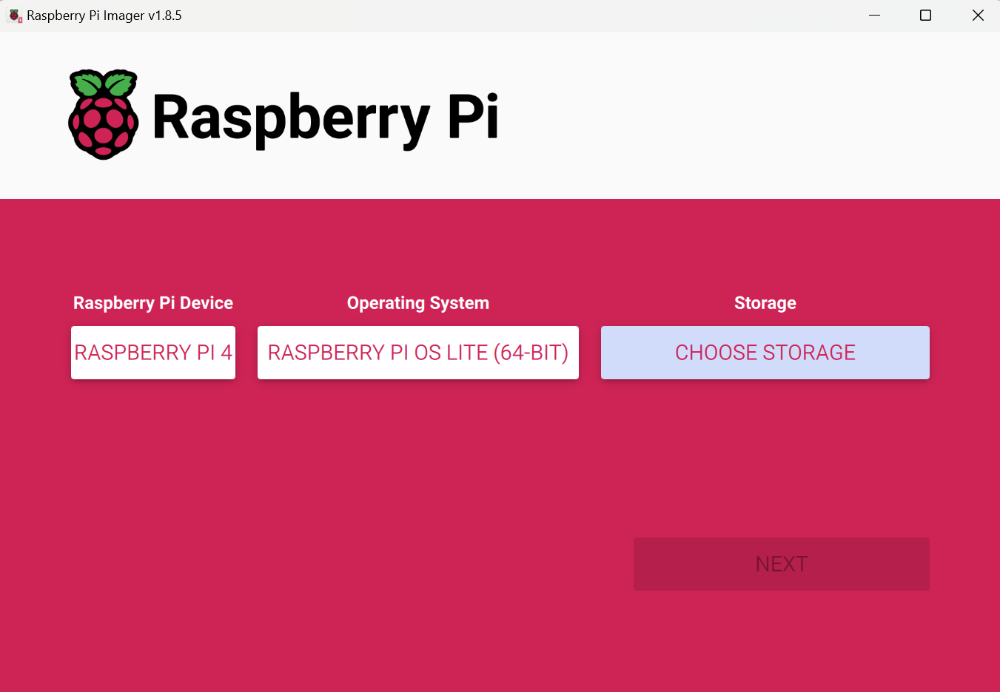

# HPC-Mini-Cluster
Welcome! The following is my procedure for setting up the HPC Mini-Cluster made up of Raspberry Pi's for ECE 4990 in preparation for potentially competing in SC25 and learning about HPC!

## Getting Started
Before beginning, collect the necessary materials of the Pi Cluster Kit, including the Raspberry Pi's, micro SD card, power cables, ethernet cables, network switch, and power supply.

Then, begin cabling everything up. Make sure to plug in the power supply and network switch to the wall power, and connect the pis to the power supply and network switches. I recommend following this [link](https://epcced.github.io/wee_archlet/#intro) for the hardware setup.

## SD Card Setup
To install the OS, install the following [tool](https://www.raspberrypi.com/software/). Insert your microSD card into your computer (using an adapter or the microSD card slot) and open the Raspberry Pi Imager. In the GUI, select the version of Raspberry Pi you are using (in my case it was Raspberry Pi 4), choose the OS version Raspberry Pi OS (other) to select Raspberry Pi OS Lite (64 bit), and finally select the SD card that you are using. After clicking next, you'll want to select Edit Settings to create a hostname, username, password, and enable ssh under the services tab for your OS. Finally, apply the settings you just configured and select to install the OS onto the SD card.

